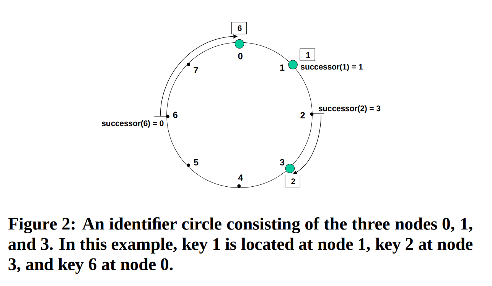
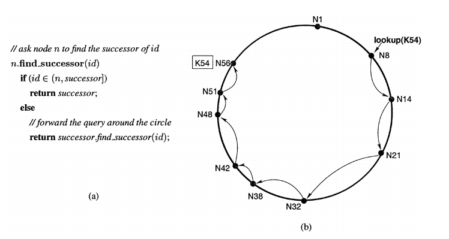
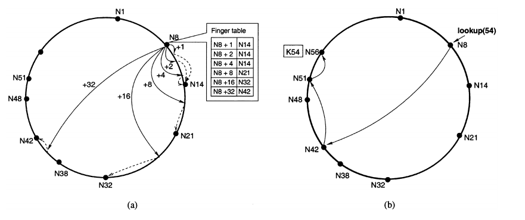

# Relatório do paper

## Paper: Chord: A Scalable Peer-to-peer Lookup Service for Internet Applications

Link para o paper <https://pdos.csail.mit.edu/papers/chord:sigcomm01/chord_sigcomm.pdf>

## como é feito o roteamento para armazenamento e para requisições

O Roteamento é feito através de um Hashing consistente (o SHA-1 é utilizado), onde as chaves de cada recurso e de cada
maquina(indentificadas por ip) ficam no mesmo espaço. Esse espaço é circular (hash(x) Mod M, onde "M" é o número de bits do hash)  e cada maquina fica
responsavel por todas as chaves diretemente antecessoras a ela ou seja, a primeira chave que representa uma maquina
que fica no sentido horario do espaço circular de chaves é a responsavel por essas chaves.

Para o descobrir qual maquina possui determinado recurso,
o paper descreve duas abordagens:

1) Busca linear:

      Aqui cada nó da rede só precisa guardar quem é o nó sucessor a ele.
      Uma busca pela chave "k" a partir de um nó arbitrario funciona da seguinte forma. Cada nó verifica se "k" pertence
      ao espaço de chaves de seu sucessor verificando se "k" está entre a chave do nó e a chave do sucessor, se sim o
      responsavel pela chave é o sucessor do nó atual e a busca termina. Se não a busca continua nó sucessor do nó 
      atual, até que o responsavel seja encontrado. No pior caso, onde o responsavel é o proprio nó que iniciou a busca
      todos os nós da rede são consultados. O(N)

2) Busca escalavel:

      Aqui cada nó mantem uma tabela com chaves e o nó sucessor a essa chave, a tabela tem no maximo M(numero de bits) entradas. Essa tabela é chamada de "Finger table". As chaves guardadas são na seguinte forma: N + 2^(i-1), onde "N" é o chave do proprio nó e o "i" é um inteiro e está no intervalo [1,M]. Consultando essa tabela a busca tenta encontrar um nó mais proximo da chave procurada. Usando essa tecnica o paper prova que com uma alta probabilidade o numero maximo de nós utilizados para encontrar o nó responsavel é O(log N)

## Se existe e qual é o esquema de replicação e caches

Não é implementado nenhum tipo de replicação ou cache nativamente.

No entanto, o paper discreve que é possivel que a aplicação use o proprio Chord para implementar o cache e a replicação.

## Como são tratadas entradas e saídas de nós na rede de overlay

### Entradas

É assumido que um nó querendo entrar na rede vai possuir o endereço de pelo menos um dos nós que compõem a rede.
Cada nó possui um ponteiro para seu predecessor e em caso de entrada de um novo nó "n", a rede precisa fazer 3 operaçoes:

1) Inicializar o predecessor e a "finger table" do nó "n", são discutidas diferentes implementações e o custo dessa operação é de pelo menos O(log N)

2) Atualizar a "finger table" e predecessores de cada nó da rede. Pelo paper é indicado que O(log N) nós vão precisar ser atualizados

3) transferir os dados vinculados as chaves que vão ser vinculadas ao novo nó "n". Essa parte depende da aplicação de mais alto nível que usa o Chord mas é comentado que pode ser feito de tal forma que apenas 1 outro nó seja usado

Para poder lidar com deversas entradas simultaneas as atualizações acima não são feitas imediatamente pela rede. Na verdade cada nó da rede faz periodicamente um procedimento chamado de "estabilização" em que o nó verifica se o sucessor de seu predecessor ainda é ele, se não for significa que um novo nó entrou na rede e ele faz as modificações necessarias.

Por esse motivo, o paper argumenta que na realidade, dependendo do estado da rede (muitos nós novos) é possivel que o tempo de encontrar a chave seja maior que O(log N) e em casos especificos pode ser que o recurso não seja encontrado e a busca falhe.

### Saidas ou Falhas

Para lidar com as falhas cada nó mantem uma lista de tamanho "r" com os seus sucessores e em caso de falha de um nó sucessor a lista é usada para encontrar o proximo sucessor e usa-lo no lugar do nó em falha. Assim como na entrada de nós, uma "estabilização" é responsavel pela atualização das listas e remoção dos nós que falharam. Aqui ele explica que para fazer replicação a aplicação utilizando o Chord podderia usar a lista de sucessores para esse fim.

