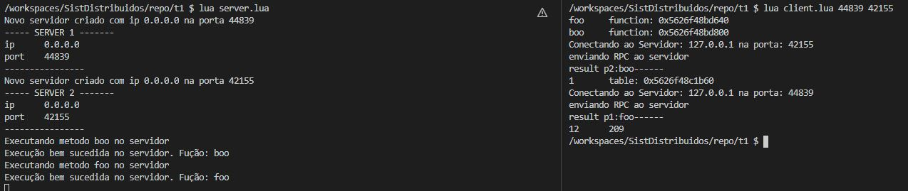
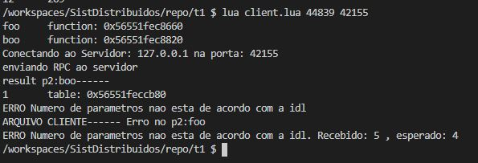
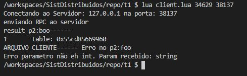

# Trabalho de RPC no k8s

## docker

docker build -t luarpc .

docker tag luarpc:latest pfsmagalhaes/luarpc:0.0.1

docker push pfsmagalhaes/luarpc

Por enquanto a interface e implementação no k8s dependem da imagem docker. Tenho que ver como poderia sobrescrever
os arquivos. Via config? ou via imagem mesmo? Como faria para ter 2 implementações diferentes rodando simultaneamente? 
Seriam deployments diferentes?? Esse seria um caso interessante para o uso do operador?? 

## K8s

kubectl -f luarpc-k8s-service.yaml apply

kubectl -f luarpc-k8s-deployment.yaml apply

### Checando no minikube

para ver o dashboard:

minikube dashboard

para ver os serviços, podemos ver aqui o ip e porta "abertas":

minikube service list

## Apartir daqui a documentação está antiga, TODO: AJUSTAR

# Trabalho de RPC

## Dependencias 

Lua socket

Lua 5.3+

## Descriçãp dos arquivos

json.lua : 

* Arquivo que faz a conversão JSON de/para obj lua 

msg-handler.lua :

* Usa o json.lua para exportar as funções:
  * "encode" que recebe um obj lua e retorna uma string JSON 
  * "decode" que recebe uma string JSON e transforma em obj lua

server.lua :

* define os objetos que implementam as funções das interfaces, usa a lib luarpc.lua para criar os "servants" do RPC e fica aguardando as chamadas socket dos clientes
* 2 server são criados:
  * server 1 implementa a interface definida no arquivo idl1.idl
  * server 2 implementa a interface definida no arquivo idl2.idl
* Imprime na tela a porta e o ip dos servidores
* Obs: Estou ignorando o ip exibido pelo server e no cliente defino diretamente o 127.0.0.1

client.lua :

* Cria os proxys 2 proxies usando o createProxy
* faz as chamadas ao server via socket
* recebe por argumento a porta dos dois servidores (criados no server.lua)
* conecta através do ip 127.0.0.1 e porta
* em seguida faz as chamadas

luarpc.lua :

* arquivo principal do trabalho, exporta as funções "createServant", "createProxy", "waitIncoming" que são usadas no cliente.lua e server.lua
* A cada vez que o servidor cadastra um servant através da "createServant" o modulo registra esse servant (identificado pela porta em uma tabela lua)
* Quando o cliente usa uma função de um obj criado pela "createProxy" uma nova conexão é aberta com o sevant correspondente e ao final da execução a conexão é fechada

## Execução:

Para os testes eu executei o arquivo "server.lua" através do comando

```
lua server.lua
```

Verificando a porta de cada "server" eu executo o cliente passando essas portas como argumento:

```
lua client.lua <porta1> <porta2>
```

A ordem das portas importa, tem que casar a implementação do servidor com o cliente 

### Exemplo de execução bem sucedida:



### Exemplo passando parametros a mais em foo:



### Exemplo parametro de tipo incorreto em foo:



## Dificuldades:

* O tratamento de erro é bem complexo e testar os tipos de erro é ainda mais complexo. A maioria dos erros de conexão como timeout ou erros de rede não foram testados. 

* Cobrir todos os pontos que podem fazer o servidor voar é bem complexo e trabalhoso

* Ao ler o arquivo de idl usando o "dofile" é introdizido um risco grande uma vez que qualquer código lua pode ser executado. Se alguem definir uma idl que ao invés de ter uma tabela de definição tiver código, ele será executado

* Só implementei a possibilidade de definir uma struct, não pensei em uma forma que permitisse definir mais de uma por arquivo de idl
