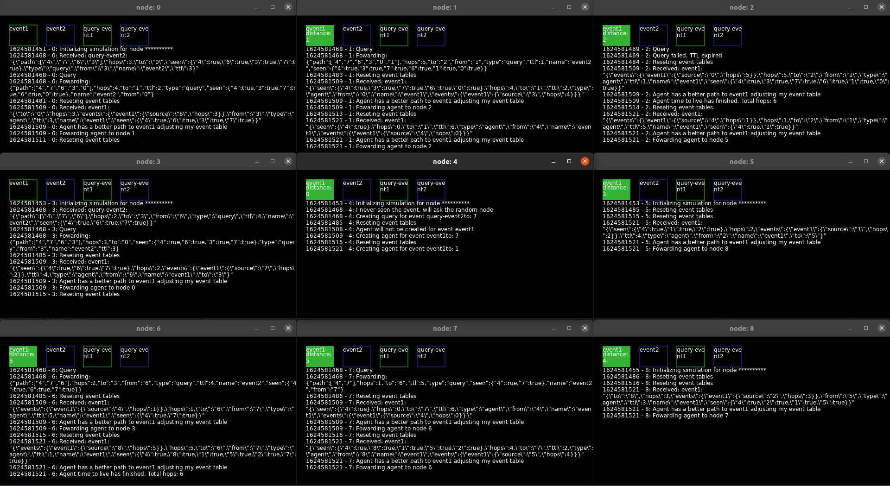
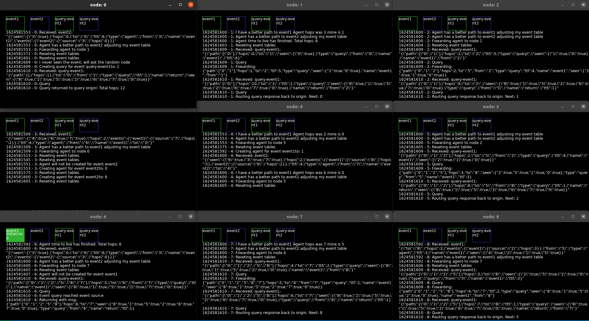
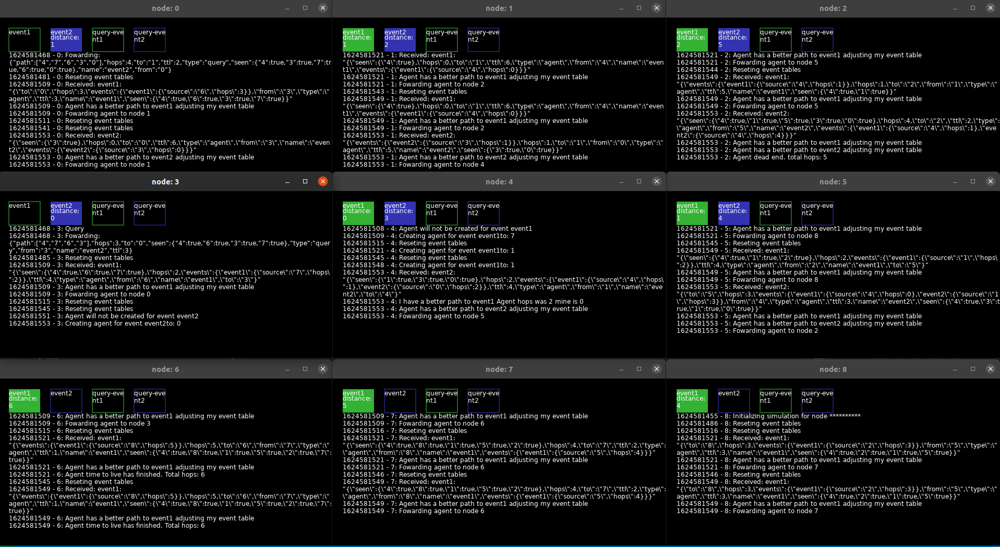
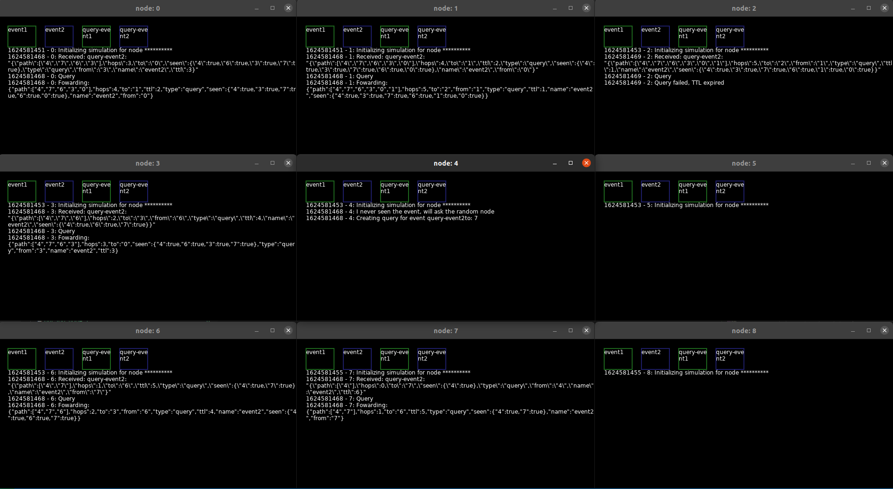
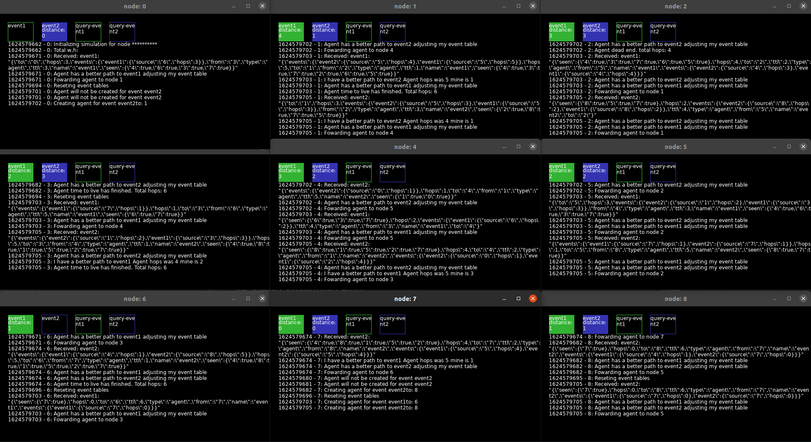

# Rumor routing algorithm

## Arquivos

### config.lua

Guarda algumas configurações para programa, nem todas estão funcionais

### log.lua

Uma implementação simples de um log com buffer em memoria

### main.lua

Implementação do algoritmo usando love2d para a interface grafica. Recebe como parametro o id do nó.

Esse id é usado pra definir a posição do nó na matriz e a posição na tela

### matrix-config.lua

Arquivo que é usado para definir o tamanho da matriz, o script [run_love.sh](./run_love.sh) faz uma 
substituição nos dados desse arquivo antes de iniciar uma execução

### run_love.sh

Script bash que gera uma execução do programa, recebe como parametro uma dimensão da matriz e gera uma execução
com uma matriz quadrada.

## Relatório

Nesse trabalho, impementei o algoritmo de roteamento por rumor. Ele funciona da seguinte forma:

### Tópicos

Cada nó ao iniciar se conecta à 4 tópicos: "event1", "event2", "query-event1" e "query-event2". Todos os nós escutam
as mensagens de todos, mas filtram para "atuar" apenas nas mensagens direcionadas a eles vindas de um de seus vizinhos.

### Botões

A interface tem quatro botões, um para cada tópico. No caso de um clique em um dos de evento, o nó adiciona à sua tabela
de rotemento o evento relacionado ao botão com "distancia" 0. Em seguida, de acordo com uma probabilidade, ele decide se
vai iniciar um agente para difundir esse evento ou não. Em caso positivo, o nó escolhe um vizinho aleatório e envia o agente via o tópico correspondente ao evento.

Caso o evento relacionado ao botão esteja na tabela de roteamento de um nó, esse botão se acente e indica a distancia para o evento e o proximo nó do caminho

Já no caso de um clique em uma query, caso ele não seja a origem do evento temos 2 opções:

* O nó possui o evento em sua tabela de roteamento - Envia no tópico relacionado a query uma mensagem para o vizinho que está em sua tabela. Na mensagem adiciona na tabela "path" o seu Id para que a mensagem possa retornar para ele.

* O nó não possui o evento - Faz o mesmo do anterior só que escolhe um vizinho aleatório

### Eventos

#### event-x - mensagem

A mensagem trasmitida nesse evento tem a seguinte forma:

```json
{
  "from": "id do nó de origem",
  "to": "destino da mensagem",
  "type": "agent | close(usado para fechar todas as janelas via mqtt)",
  "name": "nome do evento(usado para indexar a tabela events)",
  "events": {
    "hops": "total de 'pulos' até a origem do evento",
    "source": "id do nó, em geral == 'from'"
  },
  "hops": "contabiliza o total de nós visitados",
  "ttl": "tempo de vida do agente, quando chega a zero o agente termina",
  "seen": "tabela indexada pelo id dos nós que já foram visitados pelo agente"
}
```

#### event-x - funcionamento

Cada vez que um nó recebe uma mensagem de evento, ele sincroniza sua tabela de eventos com a tabela do agente. Adicionando eventos que não possui à sua tabela de roteamento colocando "hops + 1" e "source  = from", faz o mesmo caso o Agente tenha uma rota melhor que a sua. Ao final, substitui a tabela do agente pela sua nova tabela atualizada.

Em seguida envia o agente para um vizinho aleatório que ainda não foi visitado (verifica a tabela "seen"). É possível que todos os vizinhos tenham sido visitados (dead end), nesse caso o agente termina.

#### query-event-x - mensagem

```json
{
  "from": "id do nó de origem",
  "to": "destino da mensagem",
  "type": "query | reply | close(usado para fechar todas as janelas via mqtt)",
  "name": "nome do evento(usado para indexar a tabela events)",
  "hops": "contabiliza o total de nós visitados",
  "ttl": "tempo de vida da query, quando chega a zero sem encontrar um nó com rota para o evento ela falha",
  "seen": "tabela indexada pelo id dos nós que já foram visitados pelo agente",
  "path": "pilha que guarda o caminho feito pela query"
}
```

#### query-event-x - funcionamento

Ao receber uma mensagem do tipo "query" o nó primeiro verifica se ele é a origem do evento.

* Em caso positivo - A query foi um sucesso. O nó desempilha um nó dá lista "path", e devolve a mensagem para esse nó, alterando o "type" da mensagem para "reply". Esse procedimento é repetido nos nós que forem recebendo a mensagem com o "type" == "reply" até que o nó desempilhe um id == ao seu nodeId.

* Em caso negativo - O nó adiciona seu nodeId ao path, verifica se o evento existe em sua tabela de roteamento, se sim encaminha a query para o proximo nó da rota. Em caso negativo, decrementa o ttl da query se o ttl for < 1, a query falha, se não um vizinho aleatório (que não está na tabela seen) é escolhido para prosseguir com a query. (também pode ocorrer um dead end e a query terminar).

### Configs

As principais configurações do [config.lua](./config.lua) são:

* tabela com ip e porta do servidor mqtt

* path (padrão: "./logs") e nome base para o arquivo de log (por padrao é "out_log_node_" no código esse nome é concatenado com o nodeId de cada nó). Os logs com nomes iguais em execuçoes diferentes do app sofrem append (não é apagado)

* ttl do agente, probabilidade de gerar um agente ao clicar no botão de um evento (padrão - ttl: 2*dimensão , prob: 0.6)

* ttl da query, padrão 2*dimensão

* tempo para que a tabela de roteamento dos nós seja apagada (por defalut 30s), pode ser removido para que não seja apagado

### Executando

Para executar basta chamar o script passando como parametro a dimensão de um dos lados da matriz (está limitado a 5, pois a interface fica muito ruim menor que isso). Atenção para a configuração de path dos logs e o local de onde o script é chamado. Se for chamado em uma pasta fora de onde o scrip está o log pode ser salvo em um local indesejado.

```bash
./run_love.sh 3
```

fechando qualquer uma das janelas, as outras também serão finalizadas.

### Exemplo de saida de uma execução para 3x3

clicando apenas no evento 1:

Query feita com sucesso para o evento 1:

Evento 2 ocorrendo junto com o 1:


Query sem sucesso quando não há evento:


Dois evento com quase todos os nós atingidos:


